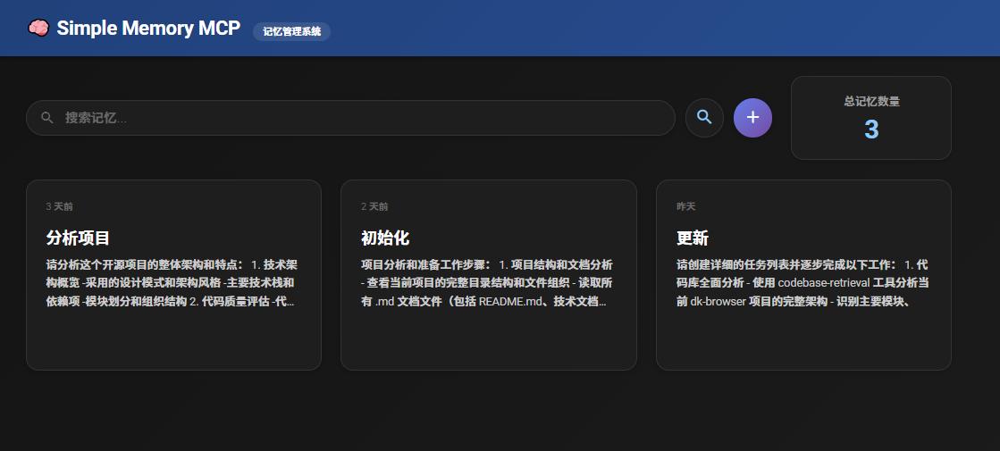

# Simple Memory MCP

[English](#english) | [中文](#中文)

---

## English

### Overview

Simple Memory MCP is a memory management system designed for AI assistants, implementing the Model Context Protocol (MCP) to provide persistent memory storage and retrieval capabilities.

### Features

- **🧠 Smart Memory Storage**: AI assistants must first ask users for memory titles, then request content
- **📋 Efficient Retrieval**: Display title lists first, users select to get complete content
- **🌐 Web Management Interface**: Intuitive visual management with full CRUD operations
- **🔍 Full-text Search**: Search through both titles and content
- **🎯 Intelligent Port Management**: Automatic port detection and conflict resolution

### Quick Start

#### Clone Repository

```bash
# Clone the repository
git clone https://github.com/eragonht1/simple-memory-mcp.git

# Navigate to project directory
cd simple-memory-mcp
```

#### Prerequisites
- Node.js 16.0.0 or higher
- 512MB RAM minimum
- 100MB available storage

#### Node.js Installation Guide

**For Windows Users:**
1. Visit [Node.js official website](https://nodejs.org/)
2. Download the LTS (Long Term Support) version
3. Run the installer (.msi file)
4. Follow the installation wizard with default settings
5. Restart your computer after installation

**For macOS Users:**
```bash
# Option 1: Download from official website
# Visit https://nodejs.org/ and download the LTS version

# Option 2: Using Homebrew (recommended)
brew install node
```

**For Linux Users:**
```bash
# Ubuntu/Debian
sudo apt update
sudo apt install nodejs npm

# CentOS/RHEL/Fedora
sudo dnf install nodejs npm

# Arch Linux
sudo pacman -S nodejs npm
```

**Verify Installation:**
```bash
# Check Node.js version
node --version

# Check npm version
npm --version
```
Both commands should return version numbers (e.g., v18.17.0 for Node.js).

#### Installation

```bash
# Install dependencies
npm install

# Initialize database
npm run init-db
```

#### Start Services

```bash
# Start MCP Server
npm start

# Start Web Interface (recommended)
node start-web.js
# or
npm run web
```

#### Access Web Interface
- Default URL: http://localhost:8011
- The system will automatically detect and allocate available ports
- Browser will open automatically with the professional launcher

### AI Assistant Configuration

#### Universal Configuration Template

Use the following configuration template for any AI assistant that supports MCP:

```json
{
  "mcpServers": {
    "simple-memory": {
      "command": "node",
      "args": ["./start-mcp.js"],
      "cwd": "/path/to/your/simple-memory-mcp"
    }
  }
}
```

**Configuration Steps:**
1. Replace `/path/to/your/simple-memory-mcp` with your actual project path
2. Add this configuration to your AI assistant's MCP settings file
3. Restart your AI assistant to load the new configuration

**Note:** The `start-mcp.js` script provides better error handling and user-friendly output compared to directly calling `src/server.js`.

### Usage Examples

#### Through AI Assistant
```
User: Help me store a memory
AI: Please provide the title for this memory:
User: Study Notes - MCP Protocol
AI: Please enter the memory content:
User: [Enter content]
AI: Memory "Study Notes - MCP Protocol" has been successfully stored!
```

#### Through Web Interface
1. Click "➕ Add Memory" to create new memories
2. Click memory cards to view details
3. Use the search box to find specific content
4. Edit or delete memories as needed

### MCP Tools

- `store_memory` - Store new memory (requires title and content)
- `list_memory_titles` - Get list of all memory titles
- `get_memory_by_title` - Retrieve memory content by title
- `delete_memory` - Delete specified memory

### Documentation

For detailed documentation, see [DOCS.md](DOCS.md) which includes:
- Complete API documentation
- Deployment guide
- Development documentation
- Port management system
- User guide

### Troubleshooting

**Port conflicts:**
```bash
# Windows
netstat -ano | findstr :8011
taskkill /PID <PID> /F

# Linux/macOS
lsof -i :8011
kill -9 <PID>
```

**Database issues:**
```bash
rm data/memories.db
npm run init-db
```

---

## 中文

### 概述

Simple Memory MCP 是一个专为AI助手设计的记忆管理系统，实现了模型上下文协议（MCP），为AI助手提供持久化记忆存储和检索功能。

### 功能特性

- **🧠 智能记忆存储**: AI助手必须先要求用户提供记忆标题，再要求输入内容
- **📋 高效检索**: 先展示标题列表，用户选择后获取完整内容
- **🌐 Web管理界面**: 直观的可视化管理界面，支持完整的增删改查操作
- **🔍 全文搜索**: 支持标题和内容的关键词搜索
- **🎯 智能端口管理**: 自动端口检测和冲突解决

### 快速开始

#### 克隆仓库

```bash
# 克隆仓库
git clone https://github.com/eragonht1/simple-memory-mcp.git

# 进入项目目录
cd simple-memory-mcp
```

#### 系统要求
- Node.js 16.0.0 或更高版本
- 最低512MB内存
- 100MB可用存储空间

#### Node.js安装指南

**Windows用户：**
1. 访问 [Node.js官方网站](https://nodejs.org/)
2. 下载LTS（长期支持）版本
3. 运行安装程序（.msi文件）
4. 按照安装向导的默认设置进行安装
5. 安装完成后重启计算机

**macOS用户：**
```bash
# 方法1：从官网下载
# 访问 https://nodejs.org/ 下载LTS版本

# 方法2：使用Homebrew（推荐）
brew install node
```

**Linux用户：**
```bash
# Ubuntu/Debian
sudo apt update
sudo apt install nodejs npm

# CentOS/RHEL/Fedora
sudo dnf install nodejs npm

# Arch Linux
sudo pacman -S nodejs npm
```

**验证安装：**
```bash
# 检查Node.js版本
node --version

# 检查npm版本
npm --version
```
两个命令都应该返回版本号（例如：Node.js显示v18.17.0）。

#### 安装步骤

```bash
# 安装依赖
npm install

# 初始化数据库
npm run init-db
```

#### 启动服务

```bash
# 启动MCP服务器
npm start

# 启动Web管理界面（推荐）
node start-web.js
# 或者
npm run web
```

#### 访问Web界面
- 默认地址: http://localhost:8011
- 系统会自动检测并分配可用端口
- 使用专业启动器时会自动打开浏览器

### AI助手配置

#### 通用配置模板

以下配置模板适用于任何支持MCP的AI助手：

```json
{
  "mcpServers": {
    "simple-memory": {
      "command": "node",
      "args": ["./start-mcp.js"],
      "cwd": "/path/to/your/simple-memory-mcp"
    }
  }
}
```

**配置步骤：**
1. 将 `/path/to/your/simple-memory-mcp` 替换为你的实际项目路径
2. 将此配置添加到你的AI助手的MCP设置文件中
3. 重启你的AI助手以加载新配置

**注意：** `start-mcp.js` 脚本相比直接调用 `src/server.js` 提供了更好的错误处理和用户友好的输出信息。

### 使用示例

#### 通过AI助手使用
```
用户: 帮我存储一个记忆
AI: 请提供这个记忆的标题：
用户: 学习笔记 - MCP协议
AI: 请输入记忆的具体内容：
用户: [输入内容]
AI: 记忆 "学习笔记 - MCP协议" 已成功存储！
```

#### 通过Web界面使用
1. 点击"➕ 添加记忆"创建新记忆
2. 点击记忆卡片查看详情
3. 使用搜索框查找特定内容
4. 根据需要编辑或删除记忆

### MCP工具

- `store_memory` - 存储新记忆（需要标题和内容参数）
- `list_memory_titles` - 获取所有记忆标题列表
- `get_memory_by_title` - 根据标题检索记忆内容
- `delete_memory` - 删除指定记忆

### 文档

详细文档请参见 [DOCS.md](DOCS.md)，包含：
- 完整API文档
- 部署指南
- 开发文档
- 端口管理系统
- 用户指南

### 故障排除

**端口冲突:**
```bash
# Windows
netstat -ano | findstr :8011
taskkill /PID <PID> /F

# Linux/macOS
lsof -i :8011
kill -9 <PID>
```

**数据库问题:**
```bash
rm data/memories.db
npm run init-db
```

---

## License / 许可证

MIT License

---

---
**Simple Memory MCP** - 让AI助手拥有持久记忆的能力 🧠✨
**Simple Memory MCP** - Giving AI assistants persistent memory capabilities 🧠✨